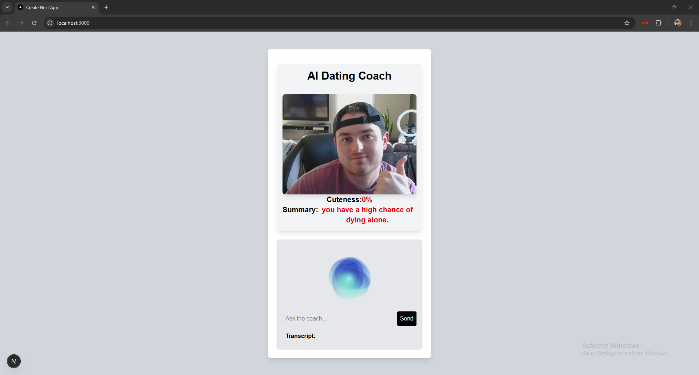
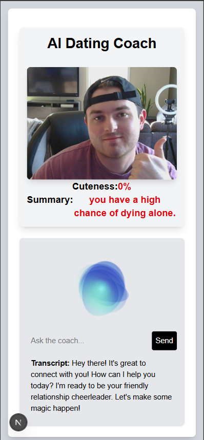

# AI Relationship Coach

An interactive AI-powered relationship coach designed to provide dating advice and ratings through webcam-based user interaction and a chatbot interface. **NOT INTENDED FOR REAL WORLD RELATIONSHIP ADVICE.**

## Screenshots

  
*Add screenshots of the app in use for better visual appeal*

  
*Another screenshot showcasing the webcam scanning feature or chatbot interface*

## About the Project

The **AI Relationship Coach** is a web application built using **Next.js**, integrating AI chat capabilities and webcam interaction to provide users with relationship advice and feedback. The app includes a unique feature where the AI "scans" the user via webcam and gives a rating, along with personalized dating advice through an AI-powered chatbot.

This project is aimed at showcasing web development skills and AI integration for fun and educational purposes. It is a great example of combining interactive AI with modern web technologies to create an engaging user experience.

## Features

- **Webcam Interaction**: The app uses the webcam to "scan" the user and provide a relationship rating.
- **AI Chatbot**: Offers personalized dating advice based on user input.
- **Real-time Feedback**: The chatbot adjusts its responses based on ongoing interactions with the user.
- **Responsive Design**: Works seamlessly across devices, providing an engaging experience on both desktop and mobile.
- **Easy Setup**: Run the app locally with just a few commands.

## Tech Stack

- **Next.js**: React framework used for server-side rendering and API calls.
- **Typescript**: Powerfull JS library used in conjunction with Next.js
- **AI LLM API**: Powered by Google Gemini (**Gemini-flash-2.0-lite**).
- **Webcam Integration**: Using React Webcam Library (currently no support for mobile devices).
- **Styling**: Styled using TailwindCSS, CSS Modules and React Modules.

## Project Structure

```bash
📂 Project Root
├── 📂 components               # React components
│   ├── Chatbot.js              # AI chatbot UI component
│   ├── WebcamScanner.js        # Webcam scanning component
├── 📂 pages                    # Next.js pages
│   ├── index.js                # Home page (webcam and chatbot)
├── 📂 public                   # Public assets
│   ├── images                  # Static images for UI
├── 📂 styles                   # Global styles
│   ├── globals.css             # Main CSS file
├── 📂 utils                    # Helper functions
│   ├── aiIntegration.js        # AI interaction logic
│   ├── webcamUtils.js          # Webcam functionality helpers
├── 📂 .env.local               # Local environment variables (e.g., API keys)


## Run Locally

Clone the project

```bash
  git clone https://github.com/CARay1502/AIRelationshipCoach
```

Go to the project directory

```bash
  cd ../AI_DATING_COACH
```

Make sure dependecies are installed/included

```bash
  cd ../package.json
```
- @google-cloud/text-to-speech 
- @google/generative-ai
- lottie-react
- next.js ("next")
- react
- react-dom 
- react-webcam 

Run the Project
```bash
  cd ../AI_DATING_COACH
  npm run dev
```

View on Local Host or Local IP
```bash
   ▲ Next.js 15.2.4 (Turbopack)
   - Local:        http://localhost:3000
   - Network:      http://XXX.XXX.X.XX:XXXX
```

